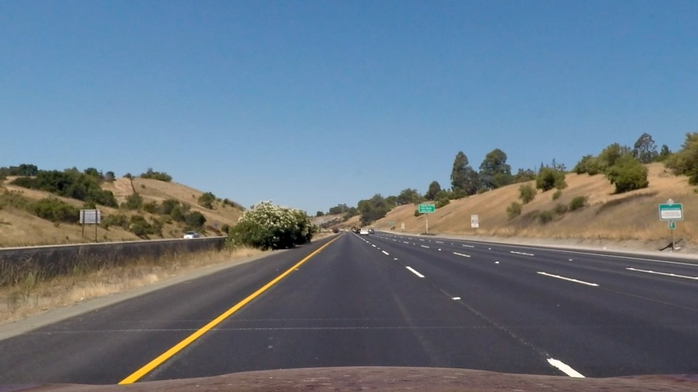
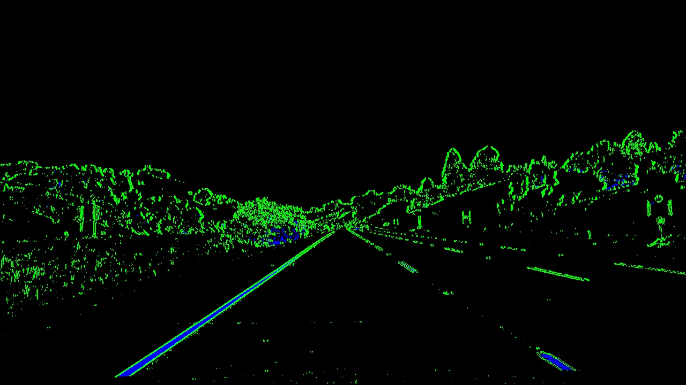
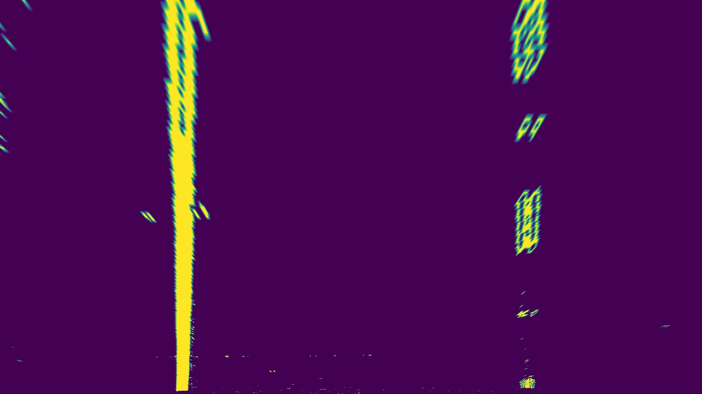
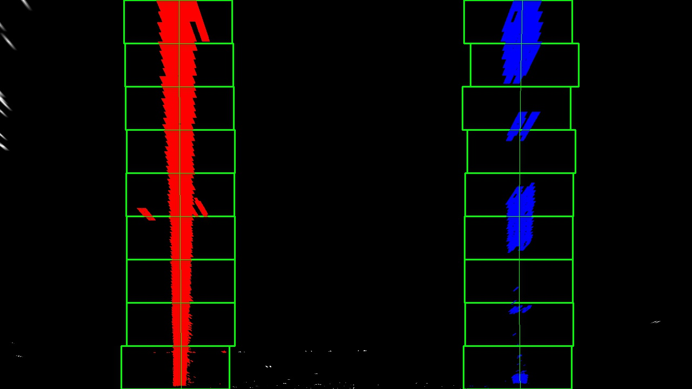
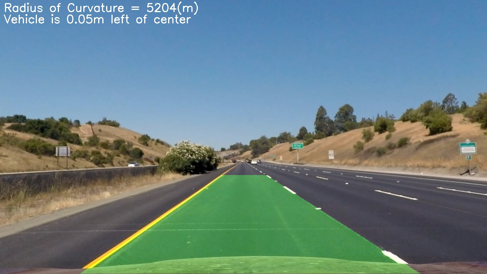
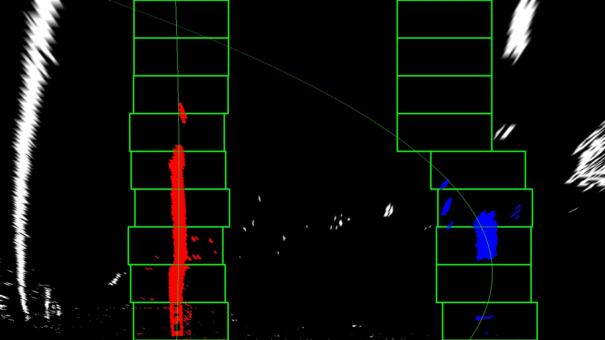
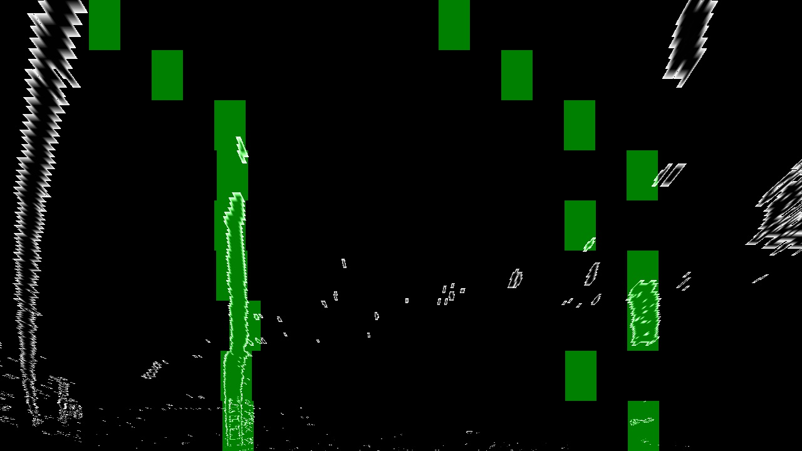
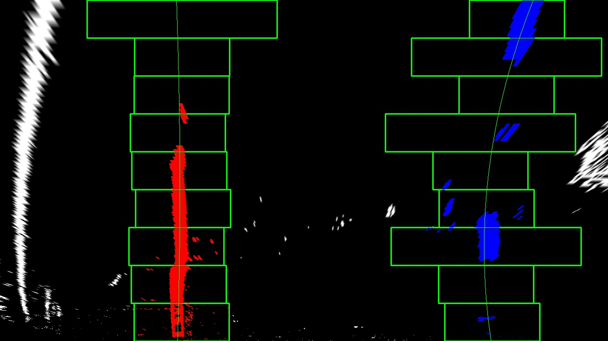

## Writeup Template

### You can use this file as a template for your writeup if you want to submit it as a markdown file, but feel free to use some other method and submit a pdf if you prefer.

---

**Advanced Lane Finding Project**

The goals / steps of this project are the following:

* Compute the camera calibration matrix and distortion coefficients given a set of chessboard images.
* Apply a distortion correction to raw images.
* Use color transforms, gradients, etc., to create a thresholded binary image.
* Apply a perspective transform to rectify binary image ("birds-eye view").
* Detect lane pixels and fit to find the lane boundary.
* Determine the curvature of the lane and vehicle position with respect to center.
* Warp the detected lane boundaries back onto the original image.
* Output visual display of the lane boundaries and numerical estimation of lane curvature and vehicle position.

[//]: # (Image References)

[image1]: ./examples/undistort_output.png "Undistorted"
[image2]: ./test_images/test1.jpg "Road Transformed"
[image3]: ./examples/binary_combo_example.jpg "Binary Example"
[image4]: ./examples/warped_straight_lines.jpg "Warp Example"
[image5]: ./examples/color_fit_lines.jpg "Fit Visual"
[image6]: ./examples/example_output.jpg "Output"
[video1]: ./project_video.mp4 "Video"

## [Rubric](https://review.udacity.com/#!/rubrics/571/view) Points

### Here I will consider the rubric points individually and describe how I addressed each point in my implementation.  

---

### Writeup / README

#### 1. Provide a Writeup / README that includes all the rubric points and how you addressed each one.  You can submit your writeup as markdown or pdf.  [Here](https://github.com/udacity/CarND-Advanced-Lane-Lines/blob/master/writeup_template.md) is a template writeup for this project you can use as a guide and a starting point.  

You're reading it!

### Camera Calibration

#### 1. Briefly state how you computed the camera matrix and distortion coefficients. Provide an example of a distortion corrected calibration image.
The camera matrix was produced by iterating through all images in camera_cal to get a good sense of the distortion matrix of this camera_cal. For each image, I do the following steps:
1. read in the images
2. convert the image to grayscale
3. call findChessboardCorners to find the corners and append them to detected corners.
4. After all images are process, run calibrateCamera on the detected corners to calculate the mtx and dist array.
5. Save the array to disk for later use.

Here is an example comparing the original image and the undistorted image.

Original

Undistored

The code for this step is contained in the camera_calibration.py).  


### Pipeline (single images)

#### 1. Provide an example of a distortion-corrected image.

To demonstrate this step, I will describe how I apply the distortion correction to one of the test images like this one:


#### 2. Convert the distortion-corrected image to binary image

I used a combination of color and gradient thresholds to generate a binary image (thresholding steps in method `color_binary()` in `processimage.py`).  Here's an example of my output for this step.  (note: this is not actually from one of the test images)



#### 3. Do perspective transform to the binary image

The code for my perspective transform includes a function called `warp_image()`, which appears in the file `processimage.py`.  The `warp_image()` function takes as inputs an image (`img`), as well as source (`src`) and destination (`dest`) points.  I chose the hardcode the source and destination points in the following manner:

```python
  src = np.float32(
      [[(img_size[0] / 2) - 60, img_size[1] / 2 + 100],
      [((img_size[0] / 6) - 25), img_size[1]],
      [(img_size[0] * 5 / 6) + 35, img_size[1]],
      [(img_size[0] / 2 + 60), img_size[1] / 2 + 100]])
  dst = np.float32(
      [[(img_size[0] / 4), 0],
      [(img_size[0] / 4), img_size[1]],
      [(img_size[0] * 3 / 4), img_size[1]],
      [(img_size[0] * 3 / 4), 0]])
```

This resulted in the following source and destination points:

| Source        | Destination   |
|:-------------:|:-------------:|
| 580, 460      | 320, 0        |
| 188, 720      | 320, 720      |
| 1102, 720     | 960, 720      |
| 700, 460      | 960, 0        |

I verified that my perspective transform was working as expected by drawing the `src` and `dst` points onto a test image and its warped counterpart to verify that the lines appear parallel in the warped image.



#### 4. Detect center of the lane line using histogram and sliding window

Then I did some other stuff and fit my lane lines with a 2nd order polynomial kinda like this:



#### 5. Use the formulate in the course to calculate the curvature
To make it readable, I change the code to convert the curvature in to meters.
I did this in method `fit_polynomial` in my code in `line.py`

#### 6. Provide an example image of your result plotted back down onto the road such that the lane area is identified clearly.

I implemented this step in `processimage.py` in the function `printOverlay()`.  Here is an example of my result on a test image:


---

### Pipeline (video)

#### 1. Provide a link to your final video output.  Your pipeline should perform reasonably well on the entire project video (wobbly lines are ok but no catastrophic failures that would cause the car to drive off the road!).

Here's a [link to my video result](./examples/project_video.mp4)

---

### Discussion

#### 1. Discussion on single image detection

As I am testing test4.jpg, I found my current algorithm failed to detect the lane correctly. See


The first thing I tried is to see if convolution will help in this case. I ran `find_print_window_centroids()` in `image.py`. But the result still signals that the algorithm failed to detect the correct lanes


After looking at the windows and curve, I conclude that there are actually two issues that causes the failure to detect curve.
1. The yellow left line blends into the bright road and causes part of the left line disappeared from the binary image.
2. The random noise in between the dotted right line causes the center of the detection to shift too much. In `test4.jpg` case, the center shifted too much to the left. This causes the algorithm failed to discover the real line  (because it is out of the margin) when the line reappears.

To solve 1, I will need to figure out a more robust way of distinguish the line with the ground in this case. It is hard to find such a solution because the real world contains many of the condition that causes the line color to blend in the road color (like rain, reflection, bright sun, dark road, wear-out line). Therefore, I don't prioritize finding solution for this.

To solve 2, I can apply some heuristic on range of curve is on a road. The assumption is that people will not draw lane that is too dramatic. The dramatic curve will surely cause a lot of accidents so I don't think it is a common case. Given the speed limit on a certain part of road, it is possible to calculate the safe maximum curve of a road. It will involve doing physics calculation to factoring the friction of car tire, the centrifugal acceleration given the car is running at the speed limit with a given curvature.
      G = v^2/r

This is on my future TODO list to calculate the actual value based on the speed limit of 65mph. For simplicity, I assume the minimal radius of the curvature is 200m.

     (x-r)^2 + y^2 = r^2


  `50 pixel` as the current limit on how far the center of the line will shift between windows.
I also accumulate the shift between windows if we cannot find a confident center in one window. This approach is much more performant than the full histogram search.


#### 2. Discussion on video
First I tested the `project_video.mp4`, while most of the time my algorithm can detect the

#### 3. performance
project_video.mp4, 1261 frames, 140 seconds -> 9 frames per second.
